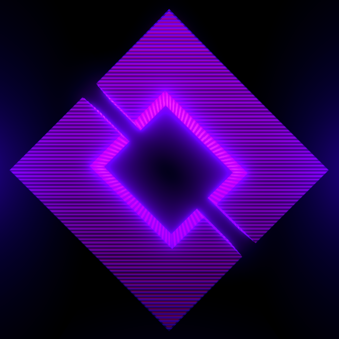

<h1 align="center" style="position: relative;">
    <br>
    BrackeysBot
</h1>

<h3 align="center">The official Brackeys Discord bot!</h3>
<h4 align="center">Contains tools to moderate the server and to create a better user experience overall!</h4>

<p align="center">
    
    
    

</p>

<p align="center">
    <a href="#building--running">Building & running</a> •
    <a href="#versioning">Versioning</a> •
    <a href="https://github.com/YilianSource/brackeys-bot/blob/master/LICENSE">License</a> •
    <a href="https://github.com/YilianSource/brackeys-bot/blob/master/.github/CODE_OF_CONDUCT.md">Code of Conduct</a> •
    <a href="https://github.com/YilianSource/brackeys-bot/blob/master/.github/CONTRIBUTING.md">Contributing</a>
</p>

## Building & running

The bot is written with **.NET Core 3.0**, meaning you can build it via `dotnet build`, which will create a binary executeable called `BrackeysBot.exe`. If you are missing packages make sure to run `dotnet restore` prior to building.

When run for the first time, the bot will create a `config.yaml` file next to your executeable. This is where all of the bot configuration will be placed. The only fields that are essential for running the bot are `token` and `prefix`.

```yaml
token: 'Get this from the developer dashboard!'
prefix: '[]'
```

## Versioning

Automatic versioning is planned for the future, but at the moment the version number needs to be manually updated in the file `Version.cs`. The system to update the version numbers goes as follows:

|Number|Description|
|--:|:--|
|Major|Only updated by the repository administrators once a completely new version is deployed.|
|Minor|Updated once a batch of features (or a [project](https://github.com/YilianSource/brackeys-bot/projects)) is fully implemented.|
|Patch|Updated once a new feature is added.|
|Hotfix|Updated if a feature requires a fix.|
